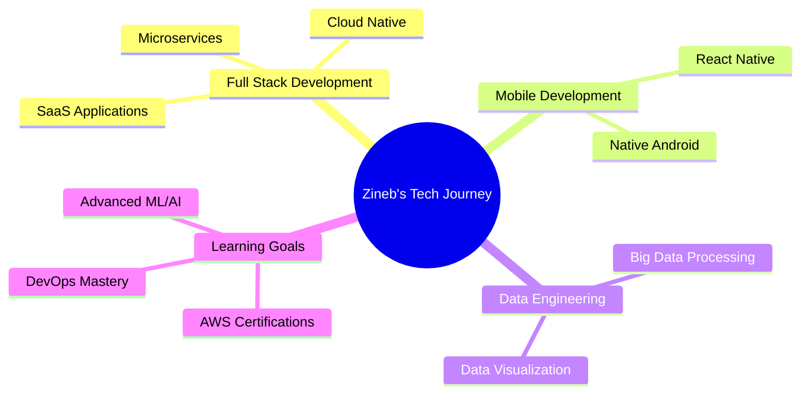

<div align="center">
  
</div>

<div align="center">
  
</div>

<div align="center">
  
  [](mailto:zinebelhalla9@gmail.com)
  [](https://www.linkedin.com/in/zineb-elhalla-bab001257/)
  [](https://github.com/ZinebELHALLA)
  [](tel:+212639416809)
  
</div>

<br>


## 💫 About Me

```javascript
const zineb = {
    location: "Morocco 🇲🇦",
    education: "ENSA El Jadida - Computer Engineering",
    currentFocus: ["SaaS Development", "Microservices", "Cloud Computing"],
    availableFor: ["Freelance Projects", "Part-time Opportunities", "Open Source"],
    languages: {
        native: "Arabic",
        bilingual: "French",
        advanced: "English"
    },
    funFact: "I turn coffee into code! ☕️➡️💻"
};
```

<br>
<br>

## 🎯 What I Do

- 🔨 Building **scalable web & mobile applications**
- 🏗️ Designing **enterprise solutions** (ERP/CRM)
- 🎨 Creating **beautiful user interfaces**
- ☁️ Deploying with **Docker & Cloud technologies**
- 📊 Analyzing **Big Data** with modern tools
- 🤖 Exploring **Machine Learning** applications

<br>

## 💼 Professional Experience

<details open>
<summary><b>🏢 ASSAB VISION (France) - Full-Stack Developer (Remote)</b></summary>
<br>

**April 2024 – July 2024**

- 🚀 Developed a **SaaS ERP/CRM** solution
- ⚙️ Stack: Express.js, TypeScript, PostgreSQL, Prisma
- 🎨 Frontend: Next.js & Tailwind CSS
- 🐳 Deployment: Docker containers

</details>

<details>
<summary><b>⚡ ONEE (Guelmim) - Data Analyst Internship</b></summary>
<br>

**July 2025 – September 2025**

- 📊 Processed electricity consumption data
- 🛠️ Tools: NiFi, HDFS, Spark, Superset
- 📈 Created data visualizations and insights

</details>

<details>
<summary><b>💧 ONEP (Guelmim) - Full-Stack Developer Internship</b></summary>
<br>

**July 2023 – August 2023**

- 💻 Built subscriber & billing management system
- ☕ Technologies: Java
- 🛠️ Provided technical support

</details>

<br>

## 🚀 Featured Projects

<div align="center">

| Project | Description | Tech Stack |
|---------|-------------|------------|
| 🛒 **SaaS E-Commerce Platform** | Microservices-based e-commerce solution | Spring Boot, Spring Security, Angular |
| 🗣️ **VoiceLearn** | Language learning app with voice recognition & ML | React Native, Kotlin, Machine Learning |
| 📸 **CamApp** | Advanced media capture mobile app | Kotlin (Native Android) |
| 🏫 **Student Management System** | Enrollment, exams & schedules management | Java JEE, Spring Boot, Spring Security |
| 💊 **PharmaciesFinder** | Pharmacy locator web & mobile app | MERN Stack, React Native |

</div>

<br>

## 🛠️ Tech Stack & Skills

### 💻 Frontend Development
<div align="center">


</div>

### ⚙️ Backend Development
<div align="center">


</div>

### 📱 Mobile Development
<div align="center">


</div>

### 🗄️ Databases
<div align="center">


</div>

### 🔧 DevOps & Tools
<div align="center">


</div>

### 🏗️ Architecture & Methodologies
<div align="center">


</div>

<br>

## 📊 GitHub Statistics

<div align="center">
  
  
</div>

<div align="center">
  
  
</div>

<br>

## 🏆 GitHub Trophies

<div align="center">
  
</div>

<br>

## 📜 Certifications

<div align="center">

| Certification | Issuer | Date |
|--------------|--------|------|
| 🎓 **AWS Academy Cloud Developing** | AWS Academy | May 2025 |
| 💾 **SQL** | SoloLearn | December 2023 |
| 📱 **React Native** | MindLuster | May 2023 |

</div>

<br>

## 🌟 Random Dev Quote

<div align="center">
  


</div>

<br>

## 📈 Contribution Graph

<div align="center">
  
</div>

<br>

## 🎯 Current Focus



<br>

## 💌 Let's Connect!

<div align="center">
  
I'm always open to interesting conversations and collaboration opportunities! 
  
Feel free to reach out if you want to:
- 💼 Discuss freelance or part-time opportunities
- 🤝 Collaborate on open-source projects
- 💡 Talk about technology and innovation
- ☕ Just have a friendly chat!

<br>

**📧 Email:** [zinebelhalla9@gmail.com](mailto:zinebelhalla9@gmail.com)  
**📱 Phone:** +212 639 416 809  
**💼 LinkedIn:** [Zineb Elhalla](https://www.linkedin.com/in/zineb-elhalla-bab001257/)

<br>


</div>

<br>

---

<div align="center">
  
  
  ### ✨ *"First, solve the problem. Then, write the code."* – John Johnson
  
  **Made with 💖 and lots of ☕ by Zineb Elhalla**
  
</div>
